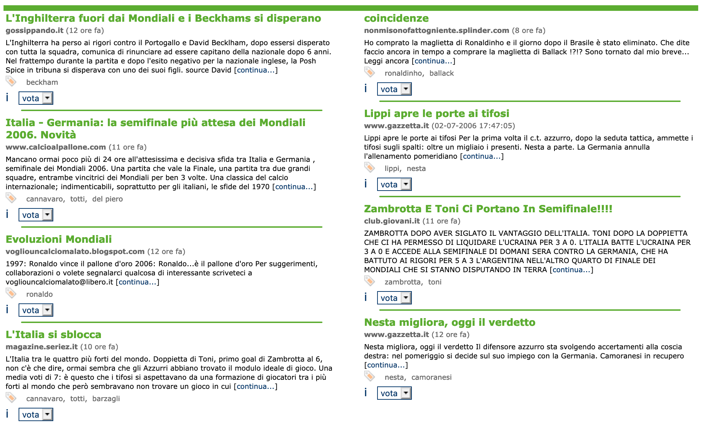
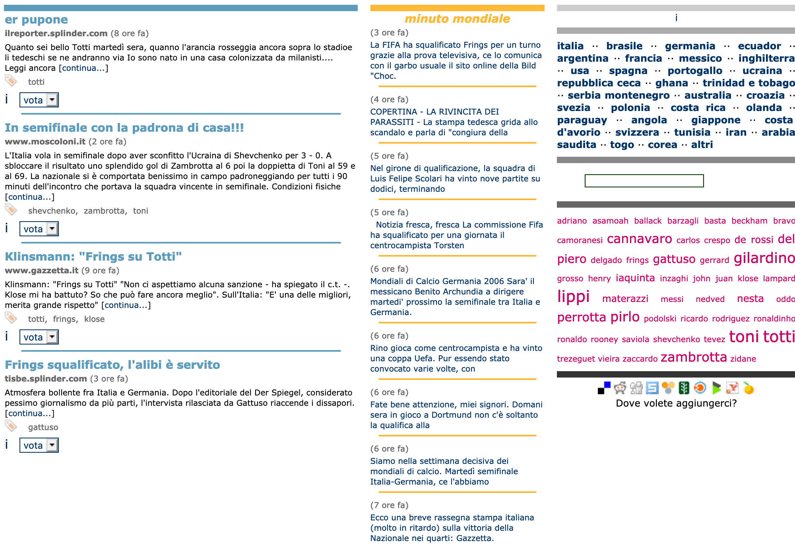
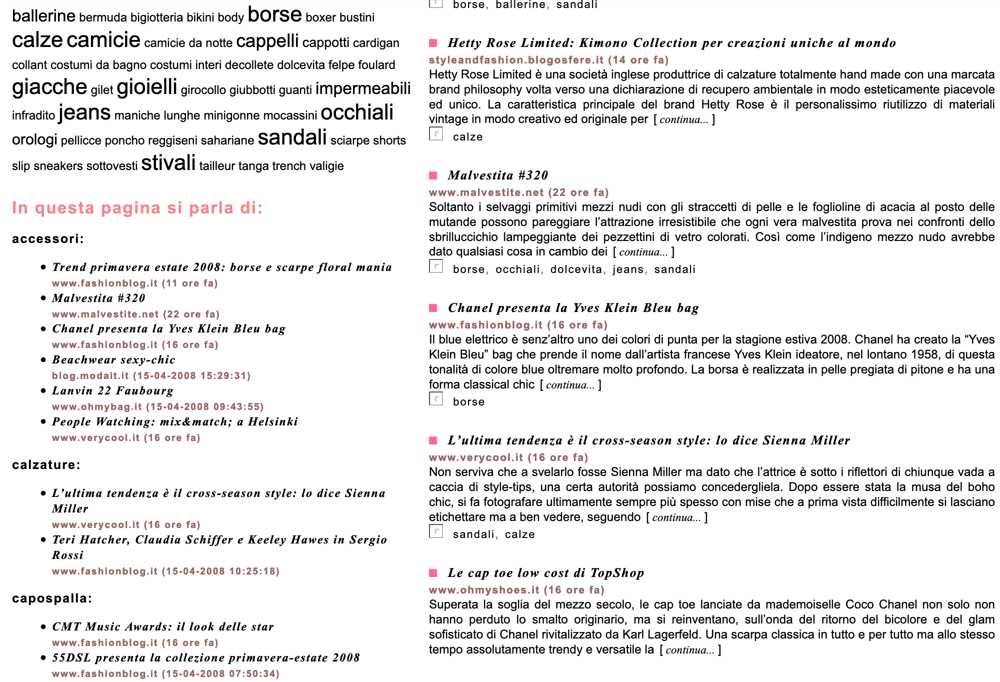

# Miki Fossati

## Comprehensive portfolio

Freelance career with global organisations working as Project Manager, Lead Developer, DevOps Manager and Chief Software Architect for high volume and very complex business to business platforms.

###### (Hint: to browse the entire portfolio just use the spacebar)

---

## Moltomondiale / Moltomoda (2006 - 2009)

> Occasionally I find a very nice original app, such as Moltomondiale in Italy - a special automatic semantic news aggregator that became popular in the World Cup. (October 3rd, 2006 - http://www.zdnet.com/article/web-2-0-clones-where-is-all-the-innovation/)

--

### Moltomondiale / Moltomoda

Automatic...
<span class="fragment">Semantic</span>
<span class="fragment">Aggregator!</span>

<span class="fragment">(in 2006)</span>

--

### Moltomondiale / Moltomoda

Written in Python (v. 2.4!!!)

<span class="fragment">With bits in C++...</span>

<span class="fragment">... and Javascript,</span>

<span class="fragment">some Java...</span>

<span class="fragment">... and Erlang!</span>

--

### Moltomondiale / Moltomoda

Multiple pipelines loosely synchronised (web crawler, categoriser, tagger, etc.) with all sorts of custom filters...

```python
class Cannavaro(RankFeature):
    def __init__(self, input, ct):
        self.ply(input)
        article = self.input['body'].lower()
        tokens = smart_tokenizer.SmartTokenizer(article)
        self.clean = tokens.tokensSS()
        self.no_rep = Set(self.clean)

    def rank(self):
        diff = len(self.no_rep) - len(self.clean)
        return int((diff/len(self.clean)) * 100)
```

--

### Moltomondiale / Moltomoda

 <!-- .element height="60%" width="60%" -->

This was automatically generated.

--

### Moltomondiale / Moltomoda

 <!-- .element height="60%" width="60%" -->

And this, tag cloud included.

--

### Moltomondiale / Moltomoda

 <!-- .element height="60%" width="60%" -->

And this was MoltoModa in 2009, still automatically generated.

--

### Moltomondiale / Moltomoda

Co-author: Andrea Baresi

---

## CMS Plus (2011)

EU-funded Research and Innovation Project

Automatic management of on-board outfit and nautical charts updates for Cargo, Passenger and Private ships.

<span class="fragment">In production since 2012.</span>

--

### CMS Plus (2011)

Backend written in Python with Flask

<span class="fragment">Frontend in Javascript with Jquery</span>

---

## Azienda-Online (2003 - to date)

<span class="fragment">Yes, more than 15 years!</span>

<span class="fragment">The current version is in production since 2009.</span>

---

## Azienda-Online Infrastructure

--

### Azienda-Online Infrastructure
## Overview

---

## Azienda-Online Code

--

### Azienda-Online Code
## Overview

---

## Maritimegate (2016)

---

## Miscellaneous